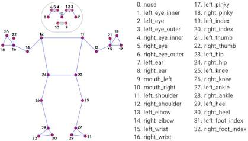

# Physio_Assistant_Project

## Overview
The Physio Assistant is an intelligent, edge-computing tele-rehabilitation application designed for real-time motion monitoring. Built on machine vision, it tracks 33 structural body keypoints using a single consumer webcam, eliminating the need for physical wearable sensors. To ensure strict patient privacy and high-performance execution without cloud latency, all kinematic calculations and video processing pipelines are executed entirely locally.

The application ships with a desktop GUI (Tkinter) that lets a patient pick an exercise protocol, walks them through a personalized calibration sequence, then tracks live reps with on-screen form feedback and per-session CSV logging.

### Tech Stack
*   **Language:** Python 3.12
*   **Computer Vision Engine:** OpenCV (4.11.0)
*   **Pose Estimation AI:** MediaPipe (0.10.21)
*   **Mathematics & Matrices:** NumPy (1.26.4)
*   **GUI:** Tkinter (standard library) + Pillow, for rendering the live camera feed inside the dashboard
*   **Session Logging:** Python's built-in `csv` module

---

## Supported Exercises

| Exercise | Slug | Required Camera Framing | Primary Joint Angle |
|---|---|---|---|
| Elbow Flexion | `elbow_flexion` | Side (sagittal) profile | Shoulder–Elbow–Wrist |
| Shoulder Abduction | `shoulder_abduction` | Front-facing | Hip–Shoulder–Elbow |
| Squat | `squat` | Side (sagittal) profile | Hip–Knee–Ankle |

Each exercise is implemented as its own subclass of `BaseExercise` and registered in `EXERCISE_REGISTRY`, so the GUI's exercise menu, camera framing instructions, and calibration flow are generated per-protocol rather than hardcoded.

---

## System Architecture

The application utilizes a decoupled, Object-Oriented software architecture to isolate the core computer vision loop, the exercise-specific mathematical constraints, and the GUI from one another.

1.  **Frame Acquisition & Threading:** Video capture and pose inference run on a dedicated background `VideoWorker` thread (one per session) so the Tkinter main loop and GUI never block on camera I/O. Frames are captured via `cv2.VideoCapture`, converted from BGR to RGB, and downscaled before inference for performance.
2.  **Inference:** Frames are passed to the MediaPipe Pose legacy API (`mp.solutions`) for structural landmark detection, chosen to maintain architectural simplicity and support clean vector mathematics.
3.  **Exercise Engine:** Landmark data flows into a modular class hierarchy — a `BaseExercise` parent class defines the shared calibration/state-machine/rep-counting contract, and each concrete subclass (`ElbowFlexion`, `ShoulderAbduction`, `Squat`) implements the joint-specific angle extraction and form-validation rules.
4.  **Results & Logging:** Each processed frame (annotated image, rep count, stage, feedback message) is pushed through a thread-safe queue back to the GUI, and simultaneously appended to a per-session CSV file under `sessions/`, ending with a summary of total reps and a breakdown of form-error counts.

### Landmark Topology Reference
The system utilizes MediaPipe's 33-point topological skeletal map to construct the necessary kinematic vectors.



### Project Structure

The four architectural layers above map directly onto the module layout:

```
physio_assistant/
├── constants.py   # logging setup, colors, SESSIONS_DIR, CSV flush interval
├── config.py      # AppConfig + BaseExerciseConfig and its 3 subclasses
├── engine.py      # BaseExercise, ElbowFlexion, ShoulderAbduction, Squat, EXERCISE_REGISTRY
├── worker.py      # VideoWorker (background thread: capture + inference loop)
├── app.py         # PhysioApp (Tkinter GUI, worker lifecycle, polling loop)
└── main.py        # thin entry point — python main.py
```

Dependencies only point one way, so the import graph is acyclic:

```
config.py, constants.py   (no internal deps)
engine.py     -> config.py
worker.py     -> constants.py, engine.py, config.py
app.py        -> constants.py, config.py, engine.py, worker.py
main.py       -> app.py
```

`EXERCISE_REGISTRY` is defined once in `engine.py`; `worker.py` (default `exercise_cls`) and `app.py` (exercise menu) both import it from there rather than maintaining separate copies.

---

## Technical Decisions & Biomechanical Logic

To transition raw AI inference into a reliable, clinical-grade tool, several mathematical and filtering constraints were implemented:

*   **Kinematic Angle Engine:** Joint angles are calculated in real-time utilizing 2D vector dot product geometry. The mathematical backbone of the system extracts the angle $\theta$ between three coordinates (e.g., shoulder, elbow, wrist) using the formula $\theta = \arccos(\frac{\vec{BA} \cdot \vec{BC}}{|\vec{BA}||\vec{BC}|})$.
*   **Signal Processing:** To mitigate the inherent pixel jitter and high-frequency noise of standard webcams, a time-constant Exponential Moving Average (EMA) digital filter is applied both to the primary tracked angle and to secondary kinematic signals (e.g. limb-length ratios, Z-axis depth) used for auxiliary form checks.
*   **Dynamic Visibility Scaling:** The system dynamically adjusts its confidence requirements, enforcing a strict 0.7 visibility threshold during calibration to secure baselines, while relaxing the threshold to 0.4 during active workouts to prevent erroneous penalties caused by natural motion blur.
*   **Per-Exercise Spatial Constraints:** A strict state machine tracks repetition validity, and each exercise checks a prioritized set of exercise-specific spatial guards before a rep is allowed to count, for example:
    *   **Elbow Flexion:** camera-profile alignment, trunk sway, elbow pinning, and Z-axis/limb-ratio checks against a person's own calibrated baseline to catch "swinging" the arm out of plane.
    *   **Shoulder Abduction:** frontal-camera alignment, trunk sway, arm foreshortening (lifting forward instead of to the side), and shoulder-shrug compensation.
    *   **Squat:** sagittal-camera alignment, knee-past-toe tracking, and forward trunk lean, using scale-invariant ratios normalized to torso length rather than fixed pixel distances.
*   **Dynamic Auto-Calibration:** Hardcoded clinical angles were abandoned in favor of an active calibration phase. The software reads a user's initial extended and flexed/squatted positions to adapt universally to individual limb proportions and personal Range of Motion (ROM) limits.
*   **Rep-Voiding on Error:** If form breaks down mid-repetition, the rep is voided and the patient must consciously return to their calibrated starting position before a new rep can begin, preventing bad reps from being silently counted.

---

## Quickstart Guide

### 1. Environment Setup
It is highly recommended to use a virtual environment to manage dependencies. Ensure you are using **Python 3.12** for wheel compatibility.

```bash
# Create and activate virtual environment
python3.12 -m venv venv
source venv/bin/activate  # On Windows use: venv\Scripts\activate
```

### 2. Installation

Install the core requirements via pip.

```bash
pip install mediapipe==0.10.21 opencv-python==4.11.0 numpy==1.26.4 pillow
```

(Note: If you encounter network proxy issues during installation in PowerShell, clear active proxy variables using `$env:HTTP_PROXY = $null`.)

### 3. Execution

Run the entry point to launch the application:

```bash
python main.py
```

`main.py` only boots the Tkinter root and `PhysioApp` — see [Project Structure](#project-structure) above for where the actual logic lives.

You'll see a menu to select an exercise protocol and which side (or camera position, for Squat) to track. Camera framing requirements differ by exercise — see the table above:

- **Elbow Flexion / Squat:** position the camera to capture your full side (sagittal) profile, standing far back enough to keep your entire torso and limbs in frame.
- **Shoulder Abduction:** face the camera directly (frontal view), standing far back enough to keep your entire torso and limbs in frame.

After selecting a protocol, follow the on-screen calibration prompts (standing still in the starting position, then holding the target end-range position) before the workout begins tracking reps.

### 4. Session Output

Each session writes a timestamped CSV log to the `sessions/` directory, recording the smoothed joint angle, state, form validity, and any feedback message per frame, plus a summary of total reps and a per-error-type count at the end of the file.